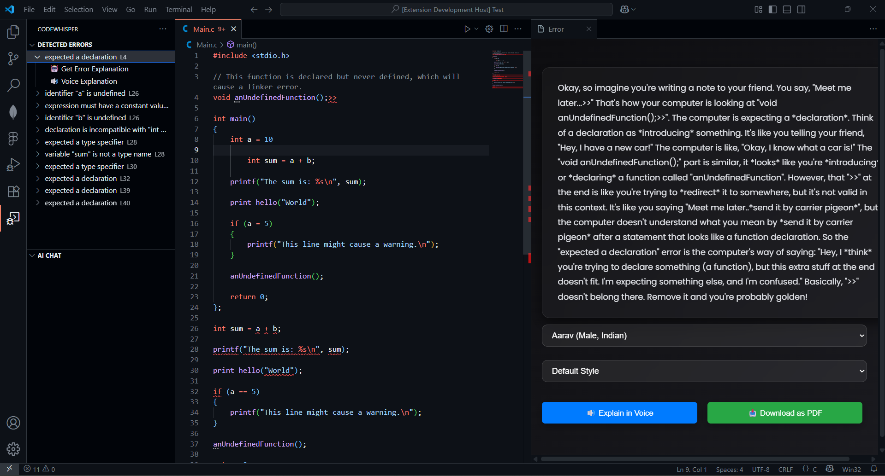
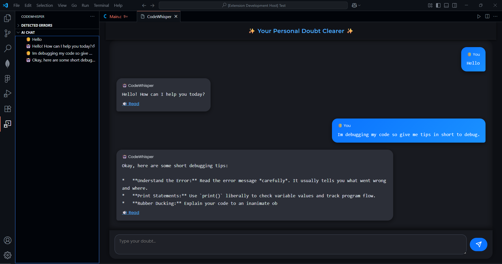

# CodeWhisper - VS Code Voice Debugger Extension🔊🐞  

An AI-powered VS Code extension that fetches code errors, provides instant AI-driven solutions, and even explains them in voice using MurfAI.
It also comes with an integrated personal doubt clearer bot for instant Q&A inside VS Code.
This makes debugging more interactive by letting you choose voice + style (Default, Conversational, Promo, Narration) for explanations.
---

## 🚀 Features
- ✅ Detects code errors in real-time.  
- 🤖 Fetches AI-powered solutions automatically.  
- 🔊 Explains solutions in **voice narration**.  
- 🎙️ Choose from multiple **voices** (Indian, US, UK).  
- 🎚️ Choose **voice styles**: Default, Conversational, Promo, Narration.  
- 💬 Integrated **personal doubt clearer bot** for instant Q&A inside VS Code.  
- 📥 Export solutions as **PDF** for later reference.  

---

## 📂 Project Structure
MURFAI/  
├── .vscode/  
│   ├── .vscodeignore  
│   ├── launch.json  
│   └── tasks.json  
├── images/  
├── node_modules/  
├── .env.local  
├── .gitignore  
├── AIChatDataProvider.js  
├── CHANGELOG.md  
├── ErrorTreeDataProvider.js  
├── extension.js  
├── jsconfig.json  
├── package-lock.json  
├── package.json  
└── README.md  

---

## ⚙️ Installation
1. Clone the repo:
```
git clone https://github.com/SyncWithRaj/VSCode-AI-Explainer-Extension.git
cd VSCode-AI-Explainer-Extension
```
Install dependencies:

```
npm install
```
Open in VS Code and press *F5* to run the extension in development mode.

## 🎤 Usage
- Open any project in VS Code.

- When you hit an error, the extension:

- Shows solution in a webview panel.

- Lets you pick Voice + Style.

- Reads the solution aloud using MurphyAI.

- You can also Download as PDF.

## 🔧 Tech Stack
- VS Code Extension API

- MurfAI (Text-to-Speech)

- AI Error Solver API ( Gemini )

- HTML, CSS, JS (for UI & webview)

## 📸 Screenshots
### Error Detection & Explanation 🐞:

_Error shown in the extension with AI-generated fix suggestions._ 


### CodeWhisper Chatbot 🔊:

_AI explaining the fix in chosen voice & style._

## 🛠️ Contributing
Pull requests are welcome! For major changes, please open an issue first to discuss what you would like to change.

## 📜 License
MIT

## ✨ Author
Made with ❤️ by Raj Ribadiya
